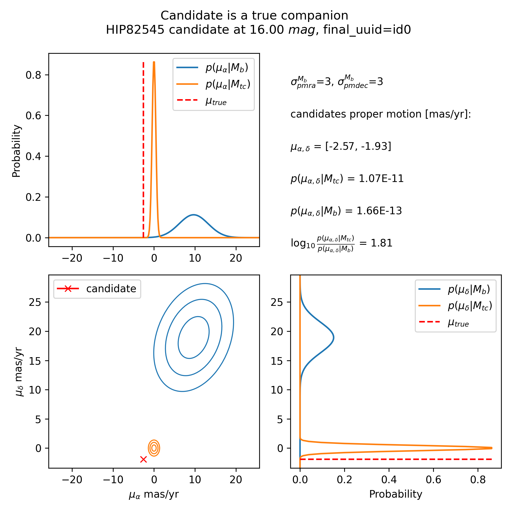
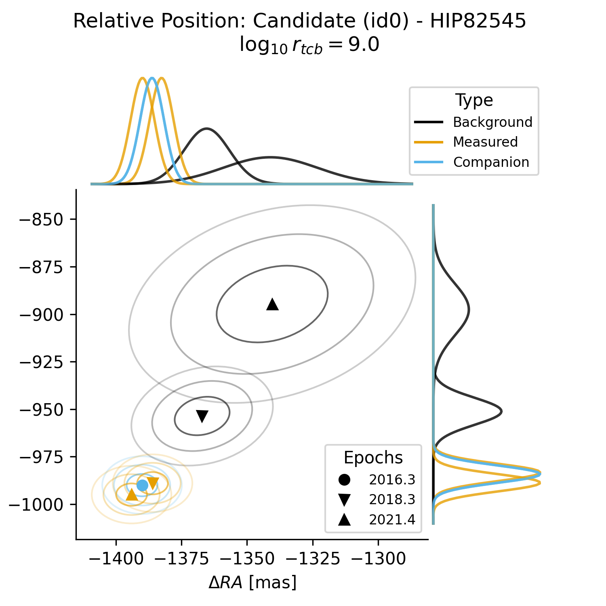
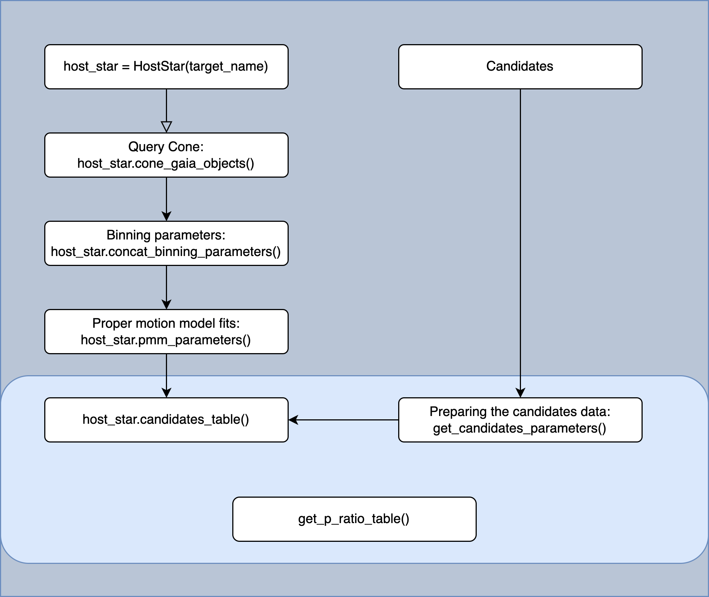

# compass
**Com**panion **P**roper Motion **A**nalysis **S**oftware **S**ystem

## Installation

You can install the package by installing this repository:

```bash
pip install git+https://github.com/herzphi/compass.git
```

## Usage
The candidates which you want to evaluate need to be prepared in the following format:

### Candidates Table
| column name | unit |
| ----------- | ----------- |
| Main_ID | host star ID accessable by Simbad  |
| date | Gregorian date |
| dRA | mas |
| dRA_err | mas |
| dDEC | mas |
| dDEC_err | mas |
| magnitudes_column_name | mag |
| final_uuid | ID used to link observations of the same candidate |

An example table of a single candidate with the identifier to1_0 can look like:
|final_uuid|Main_ID|date|dRA|dDEC|dRA_err|dDEC_err|mag0|
| - | - | - | - | - | - | - | - |
|to1_0|HIP82545|2017-05-05|-1625.0|1897.0|6|6|17|
|to1_0|HIP82545|2018-05-05|-1624.4|1891.8|6|6|17|
|to1_0|HIP82545|2019-05-05|-1631.4|1891.4|6|6|17|
|to1_0|HIP82545|2020-05-05|-1606.7|1893.1|6|6|17|

### Analysis
1. Using the prepared candidates table as mentioned a step prior, you can read the observational data.
2. Initialize the models by calling the `Survey` class and passing the observation data and the name of the magnitudes column.
3. Build the fieldstar models by defining which filter was used by the survey. Currently the supported filters are the K-, H- and J-band.
   - magnitudes_column_name_CALC = 'ks_m_calc'
   - magnitudes_column_name_2MASS has to be a 2MASS column: ks_m, j_m or h_m.
   - cone_radius: Radius in degree of the queried cone of field stars the model is build upon.
   - binsize: Number of objects in a single magnitude bin.
4. Evaluate the fieldstar models with the candidates position measurements.
   - sigma_cc_min: Set a $\sigma_{min}$ for the Gaussian distribution of the candidate.
   - sigma_model_min: Set a $\sigma_{min}$ for the Gaussian distribution of the model for the candidates magnitude.

```python
import pandas as pd
from compass import model
from compass import helperfunctions


observation = pd.read_csv('observation.csv')

survey_object = model.Survey(observation, magnitudes_column_name)
survey_object.set_fieldstar_models(
   # Color transformed column name from Gaias G-Band.
   magnitudes_column_name_CALC,
   # Column name of the corresponding magnitude in 2MASS.
   magnitudes_column_name_2MASS,
   cone_radius = 0.3, # in degree
   binsize = 200
)

# Inflating parameters to adjust the sharp dropoff of the Gaussians.
survey_object.set_evaluated_fieldstar_models(
   sigma_cc_min = 0,
   sigma_model_min = 0
)
```
Return a pandas DataFrame containing the results by determining the `threshold` of an odds ratio by which a candidate is acccepted as true companion:
```python 
survey_object.get_true_companions(threshold=0)
```

### Visualization
The package contains a module `preset_plots`, which contains a couple of intereseting plots like:
```python
import pandas as pd
from compass import model, preset_plots

df_test = pd.DataFrame({
    'Main_ID': ['HIP82545', 'HIP82545', 'HIP82545'],
    'final_uuid':['id0', 'id0', 'id0'],
    'date': ['2016-04-24', '2018-04-24', '2021-06-04'],
    'dRA': [-1390, -1386, -1394],
    'dRA_err': [5,5,5],
    'dDEC': [-990, -989, -995],
    'dDEC_err':  [5, 5, 5],
    'mag0':[16,16,16],
    'mag0_err':[1,1,1]
})

survey_object = model.Survey(df_test, "mag0")
survey_object.set_fieldstar_models("ks_m_calc", "ks_m", cone_radius=0.1, binsize=50)
survey_object.set_evaluated_fieldstar_models(sigma_cc_min=0, sigma_model_min=0)

preset_plots.p_ratio_plot(
    survey_object.fieldstar_model_HIP82545.candidates_objects[0],
    'HIP82545',
    'band'
)
```


Another preset plot is a visualization of the proper motion and parallax covariance model.
The method `p_ratio_relative_position` takes the pandas.DataFrame of a single candidate.
In this example it uses `df_test` from above which is already implemented in the `Survey` class object.
```python
preset_plots.p_ratio_relative_position(
    survey_object.fieldstar_model_HIP82545.candidates,
    'HIP82545'
)
```


This plot shows the relative position of a candidate to the host star. The symbols change with each epoch of observation. The colors show the different models:
- Black shows the candidate in the background model.
- Blue shows the candidate in the true companion model (Assuming a true companion has not relative motion to the host star).
- Yellow shows the position measurements of the candidate.
The curves on the axes show the integrated two dimenionsal gaussian distributions of each epoch, model and position measurement. The covariances between different epochs of observation are not shown in this plot, but they are considered in the calculation for the logarithmic odds ratio (given in the header).



## Contributing

Pull requests are welcome. For major changes, please open an issue first
to discuss what you would like to change.

Please make sure to update tests as appropriate.

## License

BSD 3-Clause License

Copyright (c) 2022,  Max Planck Institute for Astronomy
All rights reserved.

Redistribution and use in source and binary forms, with or without
modification, are permitted provided that the following conditions are met:

1. Redistributions of source code must retain the above copyright notice, this
   list of conditions and the following disclaimer.

2. Redistributions in binary form must reproduce the above copyright notice,
   this list of conditions and the following disclaimer in the documentation
   and/or other materials provided with the distribution.

3. Neither the name of the copyright holder nor the names of its
   contributors may be used to endorse or promote products derived from
   this software without specific prior written permission.
